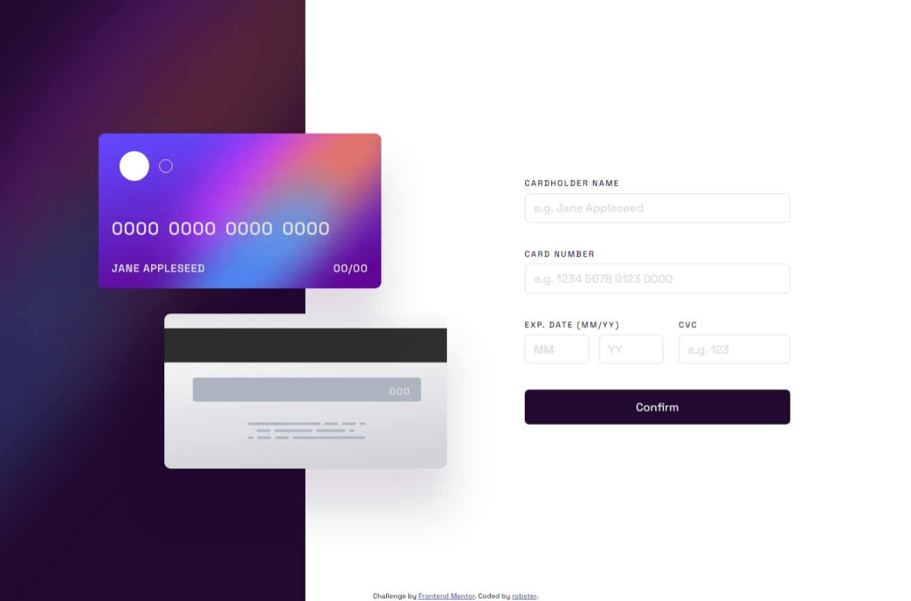

# Frontend Mentor - Interactive card details form solution

This is a solution to the [Interactive card details form challenge on Frontend Mentor](https://www.frontendmentor.io/challenges/interactive-card-details-form-XpS8cKZDWw). Frontend Mentor challenges help you improve your coding skills by building realistic projects. 

## Table of contents

- [Overview](#overview)
  - [The challenge](#the-challenge)
  - [Screenshot](#screenshot)
  - [Built with](#built-with)
  - [Links](#links)
- [Author](#author)

## Overview

### The challenge

Users should be able to:

- Fill in the form and see the card details update in real-time
- Receive error messages when the form is submitted if:
  - Any input field is empty
  - The card number, expiry date, or CVC fields are in the wrong format
- View the optimal layout depending on their device's screen size
- See hover, active, and focus states for interactive elements on the page

### Screenshot

### Built with

- Sass/SCSS
- CSS Grid
- Mobile-first workflow
- Vanilla JS
- ES6 classes

### Links

- Solution URL: https://github.com/RobStk/fem-interactive-c-details-form
- Live Site URL: https://robstk.github.io/fem-interactive-c-details-form/

## Author

- Website - https://github.com/RobStk
- Frontend Mentor - https://www.frontendmentor.io/profile/RobStk
